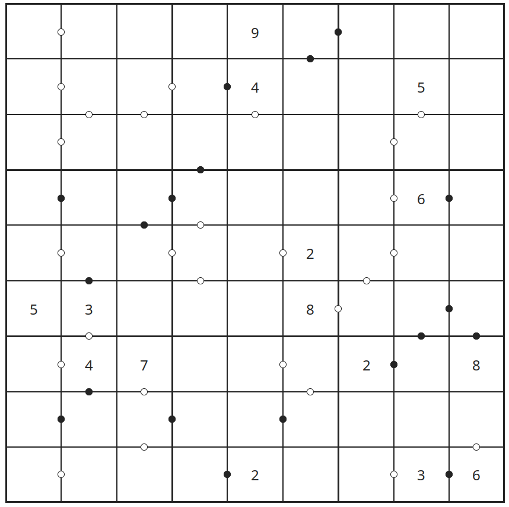
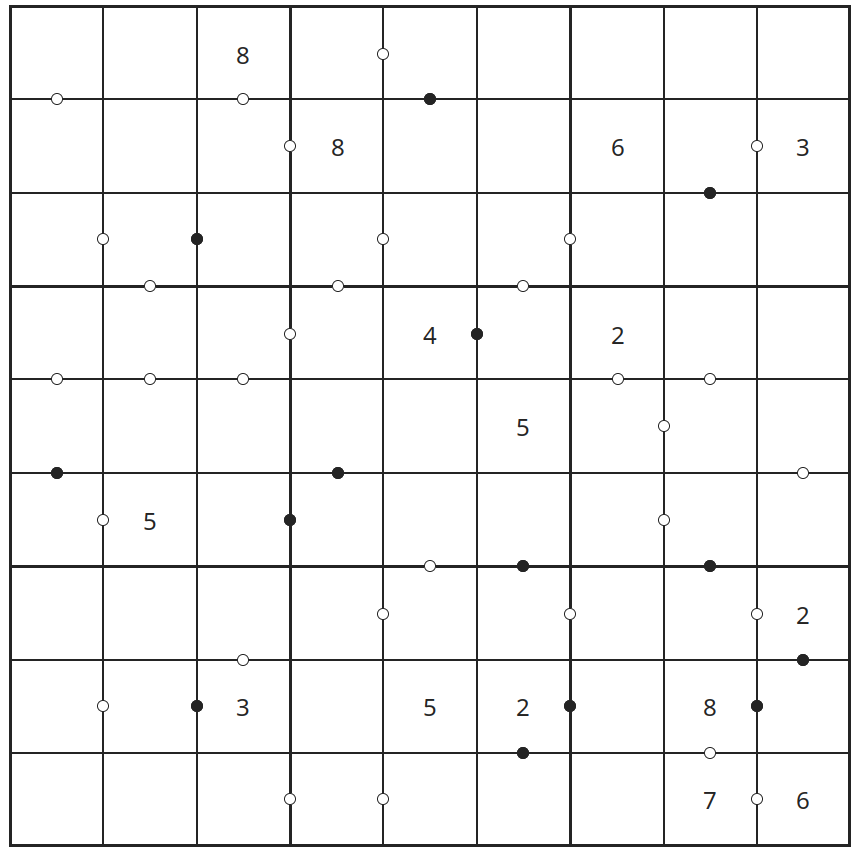

# A new obsession

Picture this: middle of July, a warm sunny day relaxing on the beach with a few friends.
Adele, a friend of mine, takes out a Sudoku magazine from her purse.
It catches my eye, and I immediately ask her:

"Hey _Adi_[^1], does it have Kropkis?"

"Of course it does!" she smirks at me.

Kropkis are a recent drug for us. They are a variant of Sudoku with the addition that
between each pair of neighboring cells there may be a dot, either white or black[^2].

If the dot is black, it means that the values in the cells must be one the double of the other,
while if it is white it means that the values must be consecutive (in either order). If no dot is present,
it means the values are neither doubles nor consecutives.

After solving the only two Kropkis in the entire magazine, she tells me: "It's a pity
there aren't any other Kropkis in here."

To which I replied: "You know, I could write a program that generates them..." :wink:



# Tackling the problem

We don't have a direct way of building Kropkis (by "direct way" I mean a formula or a specific algorithm).
One way to get around this is to _search_ for a Kropki _solution_ and then to minimize the number of hints
to have a playable Kropki.

Note that minimizing the number of hints has to account for uniqueness: we don't want a Kropki that has multiple solutions! :slightly_smiling_face:

{}
Here I'm talking about Kropkis, but the strategy outlined above works just as well for Sudokus!

The only difference between Sudoku generation and Kropki generation is how we check for uniqueness:
hints are sufficient for Sudokus, while in Kropkis we have to add the dot constraints from the original solution.
{}

## Searching for a solution

From a mathematical point of view, the problem of generating a Kropki solution can be thought of a kind of [Constraint Satisfaction Problem (CSP)](https://en.wikipedia.org/wiki/Constraint_satisfaction_problem). In a CSP you have a set of variables, $x_1, \dots, x_n$, each with a domain of possible values $D_1, \dots, D_n$, and you want to find a value for each variable that is inside the respective domain and satisfies some constraints $f_1(x_1), \dots, f_n(x_n)$. We can collectively call the collection of variables, domains and constraints $(\mathbf{x}, \mathbf{D}, \mathbf{f})$ a _model_ for a particular problem (I know this is very abstract, we're going back to Kropkis very soon).

Generally speaking, for a given problem you can produce many different models (it largely depends on the meaning you assign to variables).
For Kropkis, we can encode the problem of finding a solution with the following model:


$$
\begin{align*}
    S &= {0, 1, \dots, 8} \\ \\
    V &= {1, 2, \dots, 9} \\ \\ 
    x_{ij} &\in V \quad \forall i, j \in S \\ \\
    x_{ij} &\neq x_{ik} \quad &\forall i, j, k \in S, \;j \neq k \tag{1} \\ \\
    x_{ji} &\neq x_{ki} \quad &\forall i, j, k \in S, \;j \neq k \tag{2} \\ \\
    x_{st} &\neq x_{uv} \quad &\forall s = 3k + i, \tag{3} \\
    && u = 3k + j, \\
    && t = 3l + m, \\
    && v = 3l + n, \\
    && (i, m) \neq (j, n), \\
    && i, j, k, l, m, n \in \{0, 1, 2\} \\
\end{align*}
$$


I know, it looks like gibberish. But this _compact_ and _elegant_ gibberish contains all the information
we need to define what a Kropki is.

Translated back into English, the model says the following:
 - We have a set $S$ of coordinates (starting from zero because I'm a software engineer)
 - We have a set $V$ of possible values (1 to 9)
 - We have a variable $x$ that contains our solution
 - Constraint $(1)$ says that for each row $i$ all values must be different (note that $x_{ij}$ stands for "the value at coordinate with row $i$ and column $j$")
 - Constraint $(2)$ says that for each column $i$ all values must be different
 - Constraint $(3)$ says that for each block all values must be different. The trick is correctly encoding what a block is with indices, and you can convince yourself that the above equations work with the following diagram, where a single block is effectively identified by a pair of indices $(k, l)$:



This is how mathematically a Kropki solution is defined. It's the same as the set of rules you can find in any magazine, just not in English :upside_down_face:. Note that the model did not mention anything about the dots, because **every Sudoku solution is a Kropki solution**.
The dots are just "cosmetic" and do not alter the solution landscape in any significant way.

{}
Note that the fact that dots do not alter the model is true only because we are interested in _any_
Kropki solution.

If we were looking for a solution to a _specific_ Kropki, we would need to encode the various value constraints
(e.g. "cell at $(1, 2)$ has value 8) as well as dot constraints (e.g. "there is a black dot between cells at $(2, 3)$ and $(2, 4)$"),
and we would have a different model.

{}

Once we do have a model, we can just write a program for a CSP solver and ask for a solution. Easy peasy!

I chose to write the program in Python and leveraged the awesome [CPMpy](https://cpmpy.readthedocs.io/) library to solve the model.
All in all the model itself is fairly short:

```python
import cpmpy as cp
from itertools import product, chain

grid = cp.intvar(1, 9, shape=(9, 9)) # our `x`

# (1)
all_different_in_row = (cp.AllDifferent(*(grid[r, i] for i in range(0, 9))) for r in range(0, 9)) 

# (2)
all_different_in_col = (cp.AllDifferent(*(grid[i, c] for i in range(0, 9))) for c in range(0, 9))

# (3)
block_intervals = [list(range(0, 3)), list(range(3, 6)), list(range(6, 9))]
all_different_in_block = (cp.AllDifferent(grid[r, c] for r, c in product(*block))
                            for block in product(block_intervals, block_intervals))

model = cp.Model()

for c in chain(all_different_in_row, all_different_in_col, all_different_in_block):
    model += c

# Here's a solution
model.solve()
print(f"Solution: {grid.value()=}")
```

Probably not the kind of code I would write for anything serious like a banking platform or a healthcare device,
but for our purposes it does the job just fine.

## Minimizing a solution

With the above piece of code we can easily get a solved Kropki. But we don't want a solved Kropki.
We want a **solvable** Kropki.

Getting something we can play with means removing as much hints as possible (and drawing all the dots required by Kropki rules).

At the same time, we have to be careful when choosing what hint to remove: we can't remove any hint if it means that the
resulting Kropki has multiple solutions.
Also, nothing says that we can't start the other way around: from a blank grid we _add_ hints from the solution we computed before
until we have a Kropki with a unique solution.
I'll call these the **subtractive** and **additive** approaches respectively.

Whathever the approach we choose, we still don't have any concrete idea on how to find a playable solution.
If we take the subtractive approach as an example, we could imagine that we start with a full Kropki grid and can select 81 possible
hints for removal. For any first hint we remove, we can then check if the solution is _minimal_[^3] (i.e. no other hints can be removed such that the solution is unique) and select another hint if it's not.



Here you can see a representation of this concept. Starting from a _start node_ we can "make a move" and remove one hint (by following the arrows), and then remove another one, and so on (for example a possible path is through $(0, 0)$ and $(0, 1)$, meaning that we first remove the hint at $(0, 0)$ and remove the hint at $(0,1)$). Note that in the above diagram the order of hint removals is important: the path $(0, 0) \rightarrow (0, 1)$ is different from the path $(0, 1) \rightarrow (0, 0)$. But that's not needed in our case, because the resulting board would be the same! That means that instead of considering each node as a "move"  (and implicitly the path that was taken to get to the node as a "history"), we can map each node to a _set_ of moves: the set of moves that a path with those moves would generate, regardless of the order.

The resuling diagram would be like this, where each node represents the set of moves:



Note that now there are two arrows going into the node $\lbrace (0,0), (0,1) \rbrace$.
This change may seem inconsequential, but discarding the relevancy of order means reducing drastically the size of this diagram (thus the number of nodes our program will have to check).

We can even compute how many nodes we saved! Before, after $n$ nodes selected we could make $(81 - n)$ possible choices for each node. Expanding that idea and calling $s_n$ the total number of possible choices after $n$ moves:


$$
\begin{align*}
&s_0 = 81 \\
&s_1 = s_0 (81 - 1) \\
&s_2 = s_1 (81 - 2) \\
&\vdots \\
&s_j = s_{j - 1} (81 - j) = \prod_{k = 0}^{j} (81 - k) = \frac{81!}{(81 - j - 1)!} = (81)_{j + 1}\\ \\
N &= \sum_{i = 0}^{81} s_i \\
  &= \sum_{i = 0}^{81} \frac{81!}{(81 - j - 1)!} \\
  &\approx 1.5 \cdot 10^{121}
\end{align*}
$$


Where $(n)_k$ is the number of [$k$-permutations](https://en.wikipedia.org/wiki/Permutation#k-permutations_of_n) of a set of $n$ elements.
Note that at each $s_j$ we have $j + 1$ hints selected.

After discarding the order we get the same computation, except that $s_j$ must be divided by the number of paths that can generate the same set of moves. This is the same as the number of different permutations (i.e. orderings) of a set of $j + 1$ elements, i.e. $(j + 1)!$.


$$
\begin{align*}
&s_0 = 81 \\
&s_1 = \frac{s_0 (81 - 1)}{2!} \\
&s_2 = \frac{s_1 (81 - 2)}{3!} \\
&\vdots \\
&s_j = \frac{s_{j - 1} (81 - j)}{(j+1)!} = \frac{(81)_{j + 1}}{(j + 1)!} = \bold{C}(81, j + 1) = \binom{81}{j + 1} \\ \\
N &= \sum_{i = 0}^{81} s_i \\
  &= \sum_{i = 0}^{81} \binom{81}{j + 1} \\
  &\approx 2.4 \cdot 10^{24}
\end{align*}
$$


That's a 97 order of magnitudes reduction! Still too big to naively iterate through all $10^{24}$ nodes until we find a minimal solution.
We can instead exploit the _structure_ of our problem, and the diagram we made before is all we need. That diagram is, in fancy mathy words, a _graph_ where each _node_ encodes a set of removed hints, and each _edge_ (i.e. arrow) indicates a "one-move" distance between nodes.

The kind of problem we are describing is a [(local) search](https://en.wikipedia.org/wiki/Search_algorithm). I won't describe here all the nitty-gritty details of search algorithms, because there are plenty of resources online that can do a far better job than me, and for Kropkis there is no big insight in understanding exactly how they work.
If you are curious, I used the [A* search algorithm](https://en.wikipedia.org/wiki/A*_search_algorithm) in the hopes of finding a good heuristic, but I couldn't find one, so I stuck with $h(x) = 0$.

# Squeezing performance

By combining a CSP with a search algorithm we already have a Kropki generator. Our job is done!
But I don't want to wait several minutes to have a Kropki. I'd much rather wait at most _a few seconds_.

I was stuck on how to optimize search for quite a bit. I even considered rewriting the program from Python to another language like Rust (profiling showed that a lot of the time was spent in the CSP solver in type checking integers at runtime when checking for minimality).
I rewrote the program from the additive approach (it seemed more natural given that we are trying to minimize the number of hints, so starting from 0 instead of 81 seemed a good start) to the subtractive approach in order to get a different perspective on the problem.

At one point I just threw my hands up and said: "Whatever, I don't care about the minimal solution, it just has to be good enough". An approximate solution would be far better if it would be capable of unlocking a big speedup. And the switch to the subtractive approach made computing approximate solutions extremely natural.
For the subtractive approach, you just have to start from a subset of the initial hints instead of the full board (i.e. a partial solution). Starting from 10 hints only is in fact extremely faster than starting from 81 hints: it won't guarantee that the solution you find is optimal, but it surely is minimal (i.e. you may find a solution with 6 hints while if you started with 81 the optimal solution would have had 5, but you cannot remove any of the 6 hints you found and still have a unique solution).

This approach worked very well, and is again related to the _structure_ of the problem: Kropkis in fact need very little hints to ensure uniqueness of a solution, so by randomly removing many of the initial hints it's very likely that you didn't discard good solutions[^4].

But I wasn't satisfied still with the overall perfomance. I felt like I was leaving something on the table performance-wise. And I was.
You see, ignoring history reduced a lot our search space, but there is still some redundancy there: there are still multiple paths that get to the same result. If we managed to **fix** the exploration order, there would be no more duplication.
For example, if we decide to evaluate nodes in the natural coordinate order ($(0, 0)$ to $(8, 8)$, row by row) it means that once we get to the second row, we will not be able to change the choices we made for the first row. And that's good! If the choices we made for our first row are included in the optimal solution, there is no way we can't get to the optimal solution (because in general the order of choices is not relevant to the solution).

Let's compute the impact of fixing the exploration order. For step $s_0$ there is obviously no change, while for the second step fixing the order means that we are allowed to choose cells that come only **after** the cell chosen at step 0. For step three the same logic applies: we can't choose cells that come before the _maximum_ cell that we have already chosen, and because the cell choices can only grow in one direction, it means that the maximum cell is the one chosen at the previous step.

Focusing on the other steps, for each candidate cell $i$ we have $(81 - i)$ neighboring nodes (if we choose the first cell we can then choose any other at the next step, while if we choose the last it means we consider the whole grid as the candidate minimal solution). Writing down and computing that:


$$
\begin{align*}
s_0 &= 81 \\
s_1 &= \sum_{i = 1}^{81} (81 - i)  \\
s_2 &= \sum_{i = 2}^{81} (81 - i) \\
\vdots& \\
s_j &= \sum_{i = j}^{81} (81 - i) &\text{(substitute $k = 81 - i - j$)} \\
    &= \sum_{k = 0}^{81 - j} (81 - j - k) &\text{(substitute $l = 81 - j - k$)} \\
    &= \sum_{l = 0}^{81 - j} l = \binom{81 - j}{2} \\ \\
N &= \sum_{i = 0}^{81} s_i \\
  &= 81 + \sum_{i = 1}^{81} \binom{81 - j}{2} \\
  &= 85\,401
\end{align*}
$$


A 118 orders of magnitude reduction from the initial search space! Visually, fixing the exploration order can be seen as follows:



In this case we are considering a "path" (in the previous sense) from $(0, 0)$ to $(0, 4)$ (and assigning to them 2 and 4 respectively) and _simultaneously_ excluding cells from $(0, 1)$ to $(0, 3)$ by forcing them to be empty. In every path stemming from this we will never assign values to the cells before $(0,4)$.

Fixing the order is not difficult per se, but combining it with partial solutions seemed tricky: given a partial solution $S$ I would have to write a function that computed an ordering of cell grids that had all the cells in $S$ as a prefix, and then computed an ordering for the remaining cells that would depend on $S$ only.

After banging my head on this for a while, I wrote this plain snippet that did the job:

```python
def prefixed_sequence_generator(prefix: list[tuple[int, int]]):
    def sequence():
        grid = grid_coords() - set(prefix)

        yield from prefix
        yield from grid

    return sequence
```

Basically we get a list ($S$) in input and return a generator that yields the elements in $S$ first and then relies on Python's `set` ordering
for all other elements.

With both these tricks implemented (partial solutions and order fixing), I can get a Kropki generated in under 2 seconds on my laptop.

# Tying everything together

Now that we have our algorithm, we just need a backend to expose Kropki generation and a frontend to visualize Kropkis :fire:.

I wrote the server using FastAPI and the frontend with React, nothing special there. What I think it's worth mentioning is how I decided to encode Kropkis (both solved and playable). I named this encoding _Kropki Easy Notation_ (KEN for short), a bit like [FEN](https://en.wikipedia.org/wiki/Forsyth%E2%80%93Edwards_Notation) in chess. It's very simple: each row is delimited by `/`, and each cell has two possible encodings:
 - `N` if the cell has a value and no dots where `N` is the value inside
 - `(Nbr)` if the cell has dots, where `N` is the value inside (omitted if not present), `b` is the encoding of the bottom dot and `r` is the encoding of the right dot

Dots are always encoded, with `w` if the dot is white, `k` if the dot is black and `x` if the dot is not present.
Missing values are encoded using letters, from `A` corresponding to one empty cell, `B` corresponding to two consecutive empty cells, and so on until `H` (eight consecutive empty cells).

A generated Kropki might be like this:
```{linenos=false}
(wx)A(wx)(xw)(kx)D/B(xw)D(kw)A/(xw)(wk)A(ww)A(ww)C/(wx)(wx)(ww)A(xk)A(wx)(wx)A/(kx)B(kx)B(xw)A(wx)/(xw)A(xk)A(wx)(kx)(xw)(kx)A/B(wx)(xw)A(xw)A(xw)(kx)/(xw)(xk)C(kk)A(wk)A/B(xw)(xw)C(xw)
```

And has this solution:
```{linenos=false}
618327495/579814623/342569817/937648251/826175349/451293768/194786532/763952184/285431976
```

Viewable [here](https://kropki-gen.netlify.app/(wx)A(8wx)(xw)(kx)D%2FB(xw)8B6(kw)3%2F(xw)(wk)A(ww)A(ww)C%2F(wx)(wx)(ww)A(4xk)A(2wx)(wx)A%2F(kx)B(kx)A5(xw)A(wx)%2F(xw)5(xk)A(wx)(kx)(xw)(kx)A%2FB(wx)(xw)A(xw)A(xw)(2kx)%2F(xw)(xk)3A5(2kk)A(8wk)A%2FB(xw)(xw)C(7xw)6). Or you can see the result here below:



Given that I found KEN, it followed naturally that the frontend would be named [BARBIE](https://en.wikipedia.org/wiki/Barbie_(film)) (Board A-star Based Interactive Explorer). I still haven't decided on what easter egg to include for [{}:detective::atom_symbol:{}](https://en.wikipedia.org/wiki/Oppenheimer_(film)) though.

[And here it is!](https://kropki-gen.netlify.app) It's deployed on Fly.io for the backend (free tier) and Netlify for the frontend (also free tier), so it might be a bit slow to generate kropkis the first time you do it (and currently the frontend does not have input fields to write numbers down). Happy Kropking! :tada:

P.S.: If you want to check out the source code, you can get the generator [here](https://github.com/giovanniberti/kropki_gen) and the frontend [here](https://github.com/giovanniberti/kropki_gen_fe) :slightly_smiling_face:

> Featured photo by [Camille Minoufflet](https://unsplash.com/it/foto/d7M5Xramf8g).

[^1]: Friendly Italian nickname for "Adele"
[^2]: _Kropki_ means "dots" in Polish
[^3]: To check for minimality we use the same model used for generation and add all dot constraints from the full solution, all remaining value constraints and remove one value constraint at a time. For each iteration we can ask the solver for two solutions and keep going if it can find more than one. If we don't finish the loop early it means that it's impossible to remove a value constraint while keeping uniqueness, meaning that the solution we found is minimal.
[^4]: This property is usually referred in other contexts as _sparsity_, with the twist that sparse solutions have many zeros instead of "many holes"
